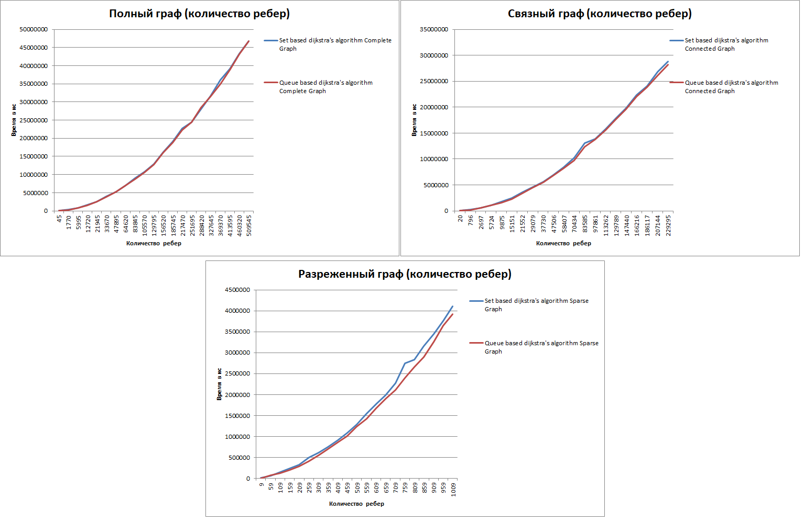
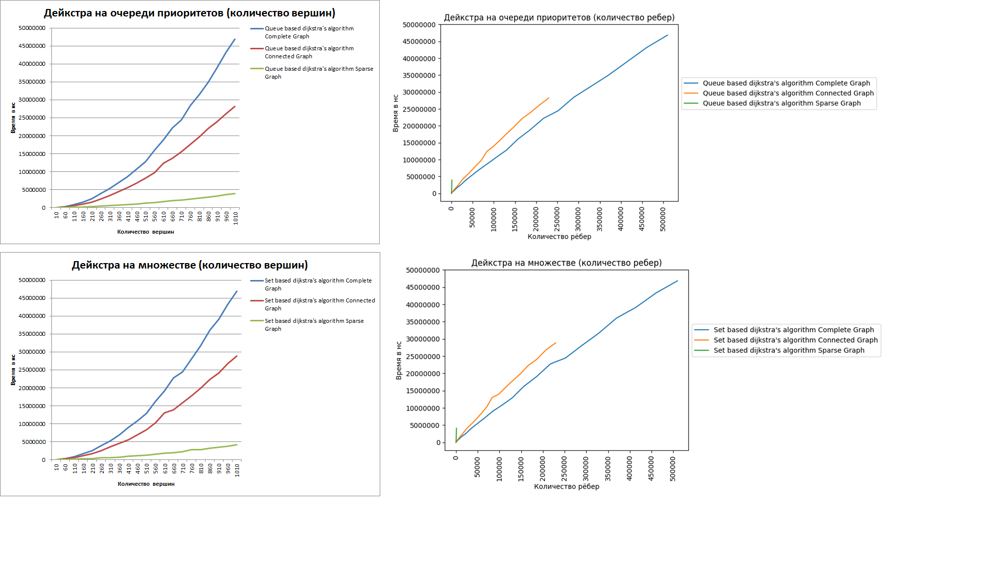
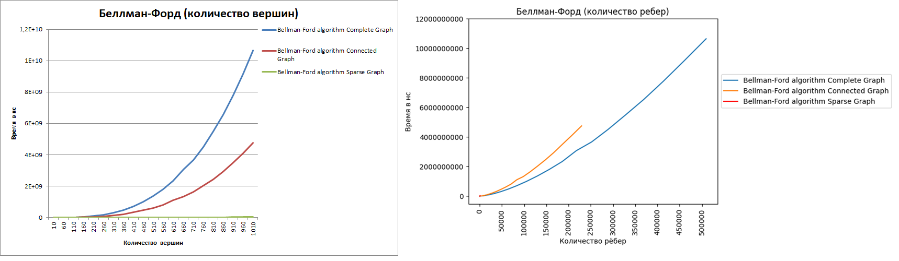
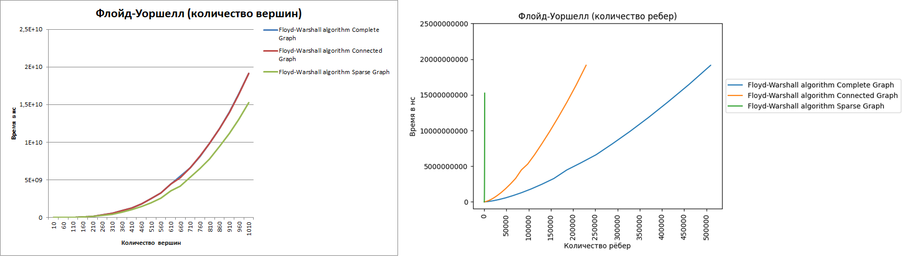
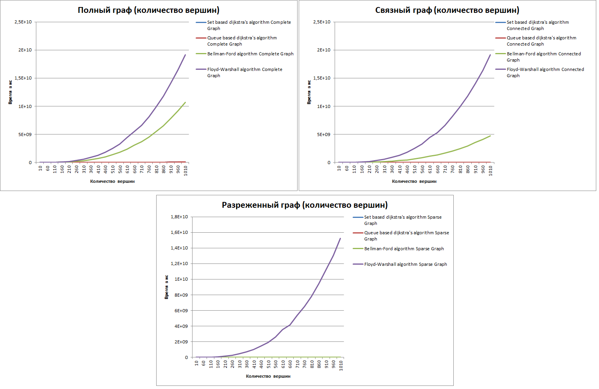

# GraphAlgorithmsAnalysis
### Шиндяпкин Илья Дмитриевич
### БПИ-219
***
## Список реализованных алгоритмов поиска:
- [Dijkstra algorithm based on set](Algorithms/DijkstraAlgorithm.cpp)
- [Dijkstra algorithm based on priority queue](Algorithms/DijkstraAlgorithm.cpp)
- [Bellman-Ford algorithm](Algorithms/BellmanFordAlgorithm.cpp)
- [Floyd-Warshall algorithm](Algorithms/FloydWarshallAlgorithm.cpp)
***

## Ввод данных
После запуска программы на выбор предоставляется выбор алгоритма поиска кратчайшего пути
в графе. Есть возможность выбрать конкретный или запустить выполнение всех 4
реализованных алгоритмов. Производится проверка на корректность выбранной опции.
Во время выполнения алгоритма в консоле будут выводиться результаты замеров и проверок.
Для временных замеров производится 5 повторений, после чего результат усредняется.
```
1. Set based dijkstra's algorithm
2. Queue based dijkstra's algorithm
3. Bellman-Ford algorithm
4. Floyd-Warshall algorithm
5. Perform all algorithms.
Input number of shortest path finding algorithm: <input>
```

После окончания выполнения алгоритма есть возможность выбрать другой алгоритм,
поскольку работа программы зациклена. Для продолжения нужно ввести один символ 'y'.
Для завершения работы программы необходимо ввести символ 'n'.
Производится проверка на корректность введенной строки.
```
Continue? (y/n): <input>
```
***
## Сохранение данных
Данные сохраняются в файл csv: RawData.csv.
Этот файл сохраняется в папку проекта *cmake-build-debug*. Для git версии вынесен в общую директорию. 
***
## Подготовка полученных данных
Подробный анализ замеров представлены в файле Analytics.xlsx, находящийся в основной директории.
В файле созданы листы, которые разделяют данные по алгоритмам:
- Алгоритм Дейкстры на базе множества.
- Алгоритм Дейкстры на базе очереди приоритетов.
- Алгоритм Беллмана-Форда.
- Алгоритм Флойда-Уоршелла.
- Агрегированные данные для всех алгоритмов по типам графов и количеству вершин.
- Агрегированные данные для всех алгоритмов по типам графов и количеству ребер.

На основе этих данных были построены графики, которые расположены в этом же файле.
На первых 4 листах располагается по 5 графиков для заданного типа алгоритма:
1 с зависимостью времени от количества вершин, 1 с зависимостью времени от количества ребер,
а также еще 3 с зависимостью времени от количества ребер для каждого типа графа.

На 2 листах располагается по 7 графиков по типу графов:
3 с зависимостью времени от количества вершин(по 1 на каждый тип), и 4 графика
для отдельных алгоритмов, сделанные для улучшения репрезентативности.
Аналогично на втором листе, но графики созданы относительно количества ребер, а не вершин.

То есть итого в файле располагается 34 графика.

***
## Анализ полученных данных

### Алгоритм Дейкстры

Были приведены две реализации алгоритма Дейкстры: с помощью множества и очереди приоритетов.
При первой реализации алгоритм Дейкстры имеет сложность
О(nlog(n)+mlog(n)), а при втором O(nlog(m)+mlog(m)), 
однако при реализации через очередь приоритетов константа будет ниже, поскольку структура
реализована на основе бинарной кучи, а множество на базе КЧД.

Ниже можно увидеть, что заметны небольшие колебания, но в среднем версия на базе
очереди приоритетов работает слегка быстрее. Особенно это заметно в разреженном графе:


Далее можно взглянуть отдельно на графики этих алгоритмов. По результатам видно,
что их эффективность весьма схожа, и вновь заметно, что на графах с малым числом ребер
начинает выигрывать реализация на очереди приоритетов:


Нужно отметить, что алгоритм Дейкстры подходит для задачи, в которой необходимо найти
кратчайший путь от стартовой вершины до любой другой, при этом должны отсутствовать ребра
с отрицательными весами. То есть для нашей задачи он подходит, но если изменить специфику,
то алгоритм применить будет нельзя.
### Алгоритм Беллмана-Форда

Алгоритм Беллмана-Форда имеет сложность O(nm).
На графике ниже четко видно, что в разреженном графе, в котором
количество ребер минимально по сравнению с полным или графом с плотностью ~0.45, время
выполнения значительно ниже:


Стоит также сказать, что этот алгоритм выполняет ту же функцию, что и алгоритм Дейкстры,
однако он подходит и для графов с отрицательными весами. Также он может обнаруживать
отрицательные циклы, за счет своего свойства: после n-1 итераций будут найдены кратчайшие
пути до всех вершин из стартовой. То есть если после выполнения n-1 запуск еще одной фазы 
вновь произведет релаксацию, то можно утверждать, что в графе есть негативный цикл, и путь до
указанной вершины его содержит.

### Алгоритм Флойда-Уоршелла
Сложность алгоритма Флойда-Уоршелла - O(n^3). Асимптотика является весьма плохой, при этом
при сокращении количества ребер время исполнения незначительно снижается, поэтому алгоритм
будет почти одинаково долго работать на любом типе графа:


Отличием данного алгоритма от других является то, что он находит кратчайший путь от всех вершин
и до всех прочих, а не только от одной стартовой вершины. Однако для нашей задачи это не является
преимуществом. Также этот алгоритм может работать с ребрами отрицательного веса, но при условии,
что в графе нет отрицательных циклов.

### Сравнение алгоритмов
Если сравнивать с другими алгоритмами, то обе версии алгоритма Дейкстры
показывают лучшие временные результаты, а алгоритм Флойда-Уоршелла худшие, причем
его эффективность не сильно улучшается при маленьком количестве ребер:



## Вывод

Алгоритм Дейкстры работает быстро, но решает задачу лишь для одной вершины и не работает с ребрами
отрицательного веса. 

Алгоритм Флойда-Уоршелла работает очень долго, но решает задачу для всех вершин в графе, 
при это может работать с ребрами отрицательного веса.

А алгоритм Беллмана-Форда работает быстрее Флойда-Уоршелла,
но все еще значительно медленнее, чем алгоритм Дейкстры, решает задачу для одной вершины, однако умеет работать
с ребрами отрицательного веса и обнаруживать негативные циклы.

В итоге можно сказать, что каждый из алгоритмов имеет свои особенности и условия применимости и в зависимости
от стоящей перед нами задачей и располагаемыми ресурсами можно выбрать тот или иной алгоритм.